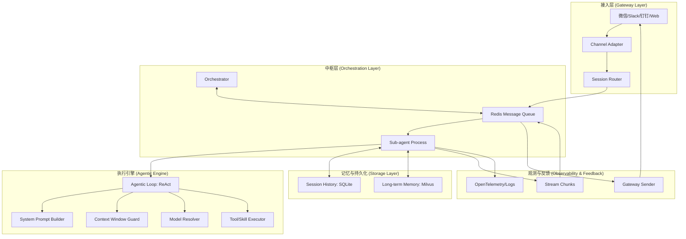

# Agentic-Core 企业级演进蓝图 (Master Roadmap)

本方案旨在将 `agentic-core` 从一个底层的进程调度器，升级为一套完整的、对标 Agentic-Core 的企业级多智能体平台架构。

---

## 1. 总体架构概览 (Overall Architecture)

---

## 2. 核心组件规格说明 (Component Specifications)

### 2.1 IM Gateway & Channel Adapter
*   **统一适配**: 建立 `internal/gateway/adapter` 接口，为每个 IM 平台实现转换逻辑（JSON to StandardMessage）。
*   **会话路由 (Session Router)**: 实现基于 Redis 的全局状态锁，确保同一个 SessionID 的消息始终路由到同一个 PID 进程，若进程不存在则触发动态拉起。
*   **网关回传 (Gateway Sender)**: 采用异步模式，Sub-agent 将响应碎片（Chunks）写入 Redis，Sender 负责将碎片合并或流式推回渠道。

### 2.2 消息队列 (Message Queue)
*   **核心载体**: Redis Streams 或 List。
*   **通信协议**: 内部定义强类型 Protobuf 或 JSON，包含 `TraceID` 以便全链路追踪。

### 2.3 核心引擎 (Reasoning Engine)
*   **模型解析器 (Model Resolver)**: 
    *   **协议**: 完全兼容 OpenAI API。
    *   **能力**: 屏蔽各家模型（GPT, Claude, DeepSeek, Ollama）的差异，支持多 Key 轮询与限流策略。
*   **提示词构建器 (System Prompt Builder)**: 
    *   **动态模板**: 支持多级组件（Profile + Memory + Tools + History）。
    *   **变量注入**: 注入当前时间、用户偏好、业务上下文。
*   **上下文守卫 (Context Window Guard)**: 
    *   **Token 截断**: 实时计算当前 Token 数。
    *   **Compact 机制**: 自动调用总结模型对长对话进行递归摘要（Recursive Summarization），保持上下文活性。

### 2.4 智能体循环 (Agentic Loops)
*   **ReAct 模式**: `Think (LLM)` -> `Action (Tool Call)` -> `Execute (Sandbox)` -> `Observation (Result)` -> `Think`。
*   **流式响应 (Stream Chunks)**: LLM 的输出直接透传到前端，显著提升用户体验。
*   **工具执行 (Execute)**: 集成 `internal/sandbox` (Wasm)，确保外部代码调用（如 cURL、数据处理）绝对安全。

### 2.5 记忆与观测 (Memory & Observability)
*   **会话历史 (Session History)**: 存储于 SQLite，支持全文检索。
*   **长记忆 (Memory)**: 基于 Milvus 的 RAG 流程，自动进行 Embedding 与相似度召回。
*   **全链路追踪 (OpenTelemetry)**: 
    *   为每次请求生成唯一 `TraceID`。
    *   记录 LLM 延迟、Token 消耗、工具执行耗时。

---

## 3. 分阶段执行计划 (Implementation Phases)

### 🚀 Phase 1: 核心链路打通 (The Backbone)
1.  **Refactor Sub-agent**: 实现 `for` 循环的 ReAct 状态机。
2.  **Model Resolver**: 整合 OpenAI / DeepSeek 提供商。
3.  **Basic Gateway**: 建立一个支持 cURL 测试的 HTTP 入口。

### 🛡️ Phase 2: 鲁棒性与安全性 (Robustness)
1.  **Context Guard**: 实现 `Compact` 总结逻辑。
2.  **Wasm Skill**: 将常用工具（Time, Http）封装为 Wasm 插件。
3.  **Session History**: 完善多轮对话的持久化与检索。

### 🌐 Phase 3: 多渠道接入 (Channel Expansion)
1.  **Slack/Web Adapter**: 实现首批渠道适配器。
2.  **Stream Sender**: 支持 SSE (Server-Sent Events) 流式推送。
3.  **Observability**: 接入 OpenTelemetry SDK 和 Prometheus。

### 📈 Phase 4: 企业级特性 (Enterprise Ready)
1.  **Multi-Model Rerank**: 优化 RAG 检索效果。
2.  **Key Quota Management**: 实现租户级的 Token 计费与限额。
3.  **Human-in-the-loop**: 实现高风险操作的 Webhook 审批流。

---
**状态**: 规划完成，等待执行
**版本**: v1.0
